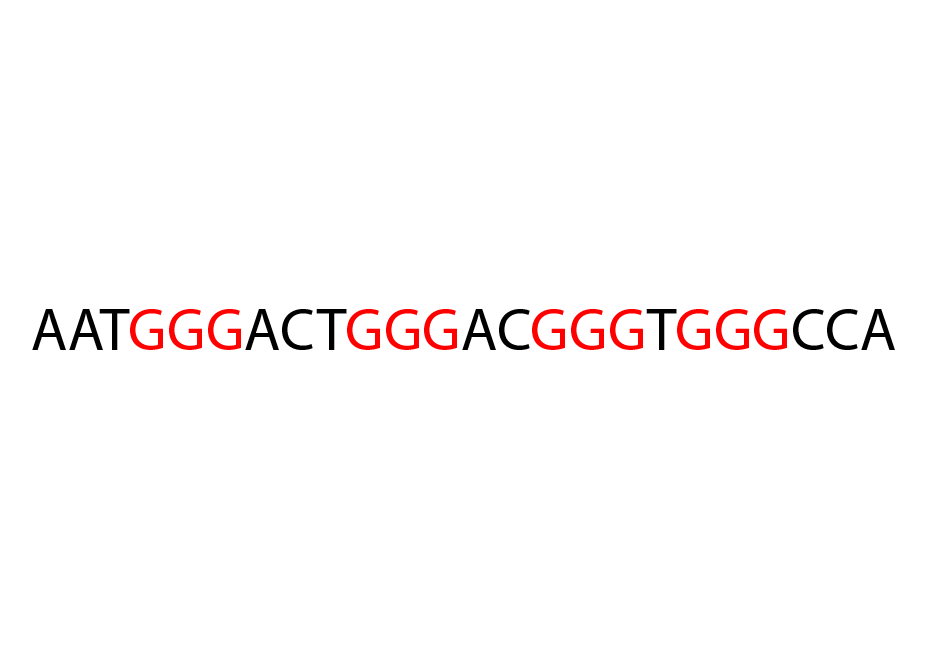

## g4predict

### Putative G Quadruplex ( G4 ) prediction using an extension of the Quadparser method

Requires linux and the regex>=2016.3.2 module

TO INSTALL:

    tar xf g4predict.tar.gz
    cd g4predict
    python setup.py build
    python setup.py install
    python setup.py test
 
## Usage:
    
    usage: g4predict [-h] {intra,inter} ...
    
    Predict putative G Quadruplexes using an extension of the Quadparser method;
    NB: Output from g4predict is unlikely to be correctly sorted. use unix sort.
    Author: Matthew Parker;
    
    positional arguments:
      {intra,inter}
        intra        Predict complete, intramolecular PG4s (i.e. PG4s which form
                     from one DNA/RNA strand). Uses the general pattern
                     G{x}([ATGC]{y,z}G{x}){3}.
        inter        Predict partial, intermolecular PG4s, which cannot form on
                     there own but might form with at least 1 other partial G4
                     from a different DNA/RNA molecule.
    
    optional arguments:
      -h, --help     show this help message and exit
    
### Intramolecular G4 prediction
    
    usage: g4predict intra [-h] -f FASTA -b BED [-t] [-s] [-F] [-M] [-c]
                           [-x TETRAD_SCORE_FACTOR] [-y LOOP_PEN_FACTOR]
                           [-tmin MIN_TETRAD] [-tmax MAX_TETRAD] [-lmin MIN_LOOP]
                           [-lmax MAX_LOOP] [-G ALLOW_G] [-B BULGES]
                           [-bmin MIN_BULGE] [-bmax MAX_BULGE]
                           [-z BULGE_PEN_FACTOR]
    
    optional arguments:
      -h, --help            show this help message and exit
    
    General:
      -f FASTA, --fasta FASTA
                            Input fasta file, use '-' to read from stdin
      -b BED, --bed BED     Output bed file, use '-' to write to stdout
      -t, --write-bed12     write bed12 output
      -s, --write-bed6      write bed6 output instead of bed12 (some information
                            is lost)
      -F, --filter-overlapping
                            use filtering method to remove overlapping PG4s,
                            yields the maximum number of high scoring, non-
                            overlapping PG4s
      -M, --merge-overlapping
                            use merge method to flatten overlapping PG4s, output
                            is in bed6 and overrides the --write-bed12 flag
      -c, --soft-mask       if input fasta contains soft masking (i.e. lower case
                            nucleotides in repetitive or low complexity regions),
                            switch on case sensitivity to ignore these regions
    
    Score:
      Score method parameters. Scoring method is x*T - y*L - z*B, where T is the
      number of tetrads, L is the total length of all loops and bulges, B is the
      number of bulges, and x, y, and z are parameters which can be set by the
      user.
    
      -x TETRAD_SCORE_FACTOR, --tetrad-score-factor TETRAD_SCORE_FACTOR
                            factor to be multiplied by tetrad number in scoring
      -y LOOP_PEN_FACTOR, --loop-pen-factor LOOP_PEN_FACTOR
                            factor to be multiplied by loop length in scoring
      -z BULGE_PEN_FACTOR, --bulge-pen-factor BULGE_PEN_FACTOR
                            factor to be multiplied by bulge number in scoring
    
    Tetrads:
      -tmin MIN_TETRAD, --min-tetrad MIN_TETRAD
                            min number of tetrads allowed in predicted G4
      -tmax MAX_TETRAD, --max-tetrad MAX_TETRAD
                            max number of tetrads in predicted G4
    
    Loops:
      -lmin MIN_LOOP, --min-loop MIN_LOOP
                            min loop length of predicted G4, either a single int
                            if all loops mins to the same length, or 3 comma
                            separated ints for loops 1 up to 3 (5'-> 3')
      -lmax MAX_LOOP, --max-loop MAX_LOOP
                            max loop length of predicted G4, either a single int
                            if all loop maxes to be the same, or 3 comma separated
                            ints for loops 1 up to 3 (5'-> 3')
      -G ALLOW_G, --allow-g ALLOW_G
                            allow G in PG4 loops, use 0 to disallow G in all
                            loops, or comma separated 0s or 1s to disallow G in
                            specific loops
    
    Bulges (Intra Only):
      -B BULGES, --bulges BULGES
                            how many bulges to allow in PG4s, can have up to one
                            per tetrad
      -bmin MIN_BULGE, --min-bulge MIN_BULGE
                            min bulge length allowed in predicted G4
      -bmax MAX_BULGE, --max-bulge MAX_BULGE
                            min bulge length allowed in predicted G4
    
### Intermolecular G4 prediction:
    
    usage: g4predict inter [-h] -f FASTA -b BED [-t] [-s] [-F] [-M] [-c]
                           [-x TETRAD_SCORE_FACTOR] [-y LOOP_PEN_FACTOR]
                           [-tmin MIN_TETRAD] [-tmax MAX_TETRAD] [-lmin MIN_LOOP]
                           [-lmax MAX_LOOP] [-G ALLOW_G] [-rmin MIN_G_RUNS]
                           [-rmax MAX_G_RUNS]
    
    optional arguments:
      -h, --help            show this help message and exit
    
    General:
      -f FASTA, --fasta FASTA
                            Input fasta file, use '-' to read from stdin
      -b BED, --bed BED     Output bed file, use '-' to write to stdout
      -t, --write-bed12     write bed12 output
      -s, --write-bed6      write bed6 output instead of bed12 (some information
                            is lost)
      -F, --filter-overlapping
                            use filtering method to remove overlapping PG4s,
                            yields the maximum number of high scoring, non-
                            overlapping PG4s
      -M, --merge-overlapping
                            use merge method to flatten overlapping PG4s, output
                            is in bed6 and overrides the --write-bed12 flag
      -c, --soft-mask       if input fasta contains soft masking (i.e. lower case
                            nucleotides in repetitive or low complexity regions),
                            switch on case sensitivity to ignore these regions
    
    Score:
      Score method parameters. Scoring method is x*T - y*L - z*B, where T is the
      number of tetrads, L is the total length of all loops and bulges, B is the
      number of bulges, and x, y, and z are parameters which can be set by the
      user.
    
      -x TETRAD_SCORE_FACTOR, --tetrad-score-factor TETRAD_SCORE_FACTOR
                            factor to be multiplied by tetrad number in scoring
      -y LOOP_PEN_FACTOR, --loop-pen-factor LOOP_PEN_FACTOR
                            factor to be multiplied by loop length in scoring
    
    Tetrads:
      -tmin MIN_TETRAD, --min-tetrad MIN_TETRAD
                            min number of tetrads allowed in predicted G4
      -tmax MAX_TETRAD, --max-tetrad MAX_TETRAD
                            max number of tetrads in predicted G4
    
    Loops:
      -lmin MIN_LOOP, --min-loop MIN_LOOP
                            min loop length of predicted G4, either a single int
                            if all loops mins to the same length, or 3 comma
                            separated ints for loops 1 up to 3 (5'-> 3')
      -lmax MAX_LOOP, --max-loop MAX_LOOP
                            max loop length of predicted G4, either a single int
                            if all loop maxes to be the same, or 3 comma separated
                            ints for loops 1 up to 3 (5'-> 3')
      -G ALLOW_G, --allow-g ALLOW_G
                            allow G in PG4 loops, use 0 to disallow G in all
                            loops, or comma separated 0s or 1s to disallow G in
                            specific loops
    
    Inter:
      -rmin MIN_G_RUNS, --min-g-runs MIN_G_RUNS
                            min runs of G to use to predict partial PG4s
      -rmax MAX_G_RUNS, --max-g-runs MAX_G_RUNS
                            max runs of G to use to predict partial PG4s
